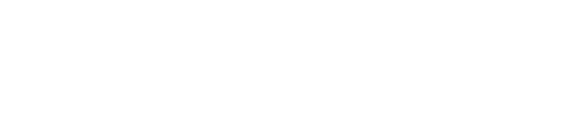

 

# BuzzKill NFT Staking Game • 

## Project Overview
Welcome to the Beehive NFT Staking Game, a unique blockchain-based game on the Viction chain where players stake bee NFTs in various hives to earn VRC25 honey tokens. This project leverages Ethereum Virtual Machine (EVM) capabilities to create an engaging and rewarding experience for NFT enthusiasts.

## Game Mechanics
In this game, players stake their bee NFTs in different hives. Each hive has unique characteristics that affect the amount of honey tokens players can earn. The longer a bee is staked, the more honey tokens accrue. The variety of hives offers players strategic choices to maximize their rewards.

## Project Structure
The project is structured into various directories:

- `lib/`: Libraries including `forge-std`, `openzeppelin-contracts`, `vrc25`, and `vrc725`.
- `script/`: Deployment scripts for game components.
- `src/`: Main Solidity contracts for NFTs, reward tokens, utilities, and the vault.
- `test/`: Test files for the smart contracts.

### Contract Interfaces and Functionality
#### NFT Contract (`BuzzkillNFT`)
- **Purpose**: Represents the bee NFTs using the VRC725 standard
- **Key Functions**:
  - `mintTo`: Mint new NFTs.
  - `burn`: Burn existing NFTs.
  - `withdrawPayments`: Withdraw payments.
  - Other administrative functions like `pause`, `unpause`, and price updates.

#### Reward Token Contract (`Honey`)
- **Purpose**: Manages the VRC25 honey tokens.
- **Key Functions**:
  - `mintTo`: Mint honey tokens to an address.
  - `burn`: Burn honey tokens from an address.
  - `setControllers`: Manage controllers of the token.
  - VRC25 functions such as `balanceOf` and `transferFrom` for token balance and transfer.

#### Vault Contract (`HiveVaultV1`)
- **Purpose**: Handles staking logic and reward distribution.
- **Key Functions**:
  - `stakeBee` and `unstakeBee`: Stake and unstake bees in hives.
  - `claim`: Claim accumulated honey tokens.
  - `getHiveTraits`: Get traits of a specific hive.
  - Other functions for hive management and reward calculation.

#### Bee Skills Contract (`BeeSkills`)
- **Purpose**: Manages character traits for each NFT.
- **Status**: Work in progress.
- **Key Functions**:
  - `upgradeAttack`, `upgradeDefense`, `upgradeForaging`: Enhance bee traits.
  - `raidAHive`: Raid a hive for rewards.
  - `initializeBeeTraits`: Set initial traits for a bee.
